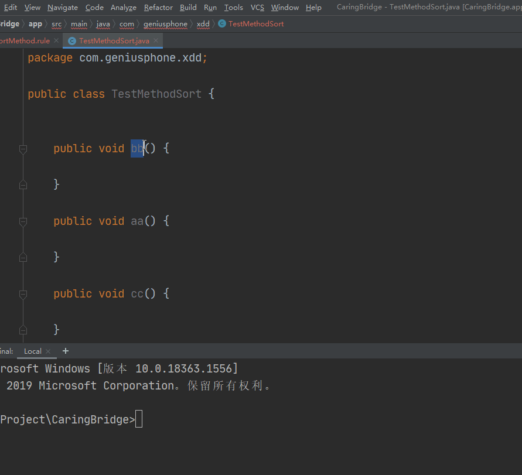

Custom method sort

[中文版](README_zh.md)

	Only support Java And Kotlin Method sort

# setp 1

	 add 'sortMethod.rule' file in your project root directory ，

     file name must is 'sortMethod.rule' 

# setp 2

	input sort method name，eg:
	
	aa
	bb
	cc

# setp 3

	call 'Code---->Custom Sort Methods'

